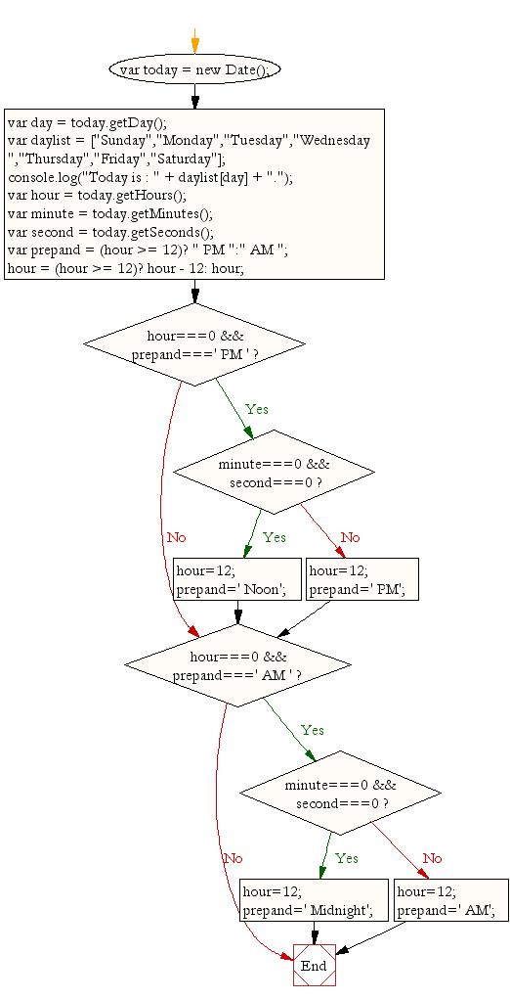

# Notes and Links on Current Date and Time Program

## Links
	JavaScript Date Object Link:
	https://www.w3resource.com/javascript/object-property-method/date.php

### Topics used in the program
	* Using Variables
	* JavaScript Date object
		* using of object methods
	* Creating an Array
		* How to access data in an Array
	* How to output to the console
	* (?) question mark operator
	* if-else conditional statement
	* Use of ES6 Syntax....

## Notes

### Program Flowchart
	

#### Using Variables

	Link to learn variables:
	https://javascript.info/variables
	https://tutorial.techaltum.com/javascript-variables.html

		

		

	JavaScript use variables to store data values. There are numerous
	of data types that is used to describes variables such as: string, number,
	Boolean etc..

	There are three keywords that is used to describe a variable.
	These keywords are:
		* let
		* Const
		* var

#### JavaScript Date object

	Link to understand usage of Date object:
	https://www.w3schools.com/js/js_dates.asp
	https://www.w3schools.com/jsref/jsref_obj_date.asp
	https://www.w3schools.com/js/js_date_methods.asp

	JavaScript Date objects represent a single moment in time in a platform-independent format.

#### Creating JavaScript Array

	Link to Learn Array: https://javascript.info/array

	

	The Array object lets you store multiple values in a single variable. It stores a fixed-size
	sequential collection of elements of the same type.  An array is used to store a collection of data, but it is often more useful to think of an array as a collection of variables of the same type.

#### How to output in JavaScript

	Links to Learn Outputting in JavaScript:
	https://javascript.info/alert-prompt-confirm
	https://www.w3schools.com/js/js_output.asp

	The following are a list of different methods to output from JavaScript:
		* innerHTML
		* window.alert
		* prompt
		* confirm
		* document.Write
		* console.log

	In JavaScript, there are numerous of ways to output information to the user, browser or console.
	However, the three popular output methods are: innerHTML, document.write, and console.log.

#### The Question Mark (?) operator

		Links to Learn the Question Mark (?) Operator:
		https://developer.mozilla.org/en-US/docs/Web/JavaScript/Reference/Operators/Conditional_Operator
		https://www.javascripttutorial.net/javascript-ternary-operator/

 		The question mark (?) is an alternative to an if statement best used in the case where one of two values will be assigned to a variable based on a conditional statement.

		The question mark operator takes in three (3) operands and can be referred to as the Ternary Operator.

		The Ternary Operator contains:
			* The condition lives in parentheses.
			* The value if true comes first
			* the value if false comes second.

		Example: (1 + 1 = 2) ? "Pass" : "Fail". Base on this example, it explain the question mark and the colon operators together are the ternary operator.

#### if-else conditional statement

	Links to Learn if-else statements:
	https://www.w3schools.com/js/js_if_else.asp
	https://javascript.info/ifelse

	In JavaScript there are a number of conditional statements. The if is used to specify a block of code to be executed, if a specified conditional is true. then the else is used to specify a block of code to be executed, if the same condition is false.

#### Use of ES6 Syntax

Links to learn ES6:
https://www.w3schools.com/js/js_es6.asp#:~:text=Arrow%20Function%20chapter.-,Classes,always%20add%20a%20constructor%20method.
https://www.javascripttutorial.net/es6/
https://www.tutorialspoint.com/es6/es6_syntax.htm

ES6 stands for ECMAScript 6. ECMAScript was created to standardize JavaScript, and ES6 is the 6th version of ECMAScript, it was published in 2015, and is also known as ECMAScript 2015.
